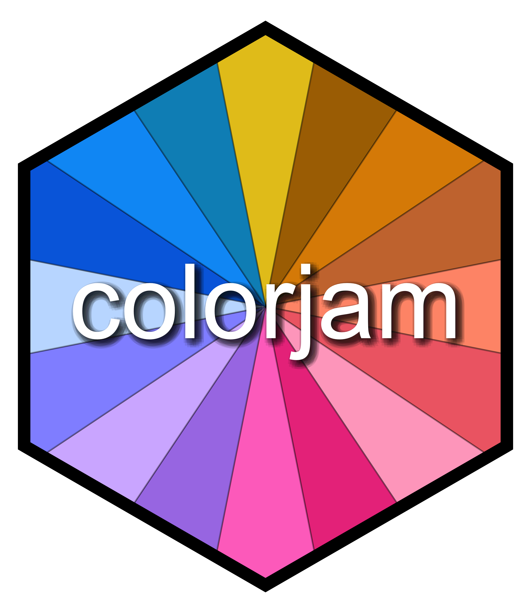

```{r knitr_init, echo=FALSE}
knitr::opts_chunk$set(
  collapse=TRUE,
  warning=FALSE,
  message=FALSE,
  comment="#>",
  fig.path="man/figures/README-"
);
```
# colorjam 

The goal of colorjam is to provide useful color manipulation functions
for R data visualization.

It includes methods to generate dynamic categorical colors of
arbitrary length, providing as much visual separation between
adjacent colors as currently feasible.

## Installation

To install colorjam, use the `devtools` package installer:

> devtools::install_github("jmw86069/colorjam");

Note that colorjam Depends upon the "jamba" package for some
manipulations.

## Command reference

A full command reference is provided using the `pkgdown::build_site()`
function, and is available here:

[Full command reference](https://jmw86069.github.io/colorjam)

## Quick start with colorjam

For the examples below, two packages are loaded:

```{r, packages}
library(colorjam);
library(jamba);
```

### Categorical colors

First generate some basic categorical colors, `n=5` colors. We
will use the function `jamba::showColors()` to display the colors.

```{r, cat5, fig.width=6, fig.height=5}
showColors(rainbowJam(5));
```

To illustrate the effect of increasing categorical colors,
we will create a list of categorical colors with increasing `n`.

```{r, cat_list_ryb}
colorList <- lapply(nameVector(c(5, 10, 20)), function(n){
   rainbowJam(n);
});
showColors(colorList,
   main="Red-Yellow-Blue color wheel (default colorjam)");
```

By default, colorjam uses a "warped" color wheel, which produces
Red-Yellow-Blue equally spaced. The effect is color additive,
which is beneficial when blending colors as well as selecting
categorical colors.

To view Red-Green-Blue colors using the default color wheel
in base R, supply `warpHue=FALSE` as shown below:

```{r, cat_list_rgb}
colorList2 <- lapply(nameVector(c(5, 10, 20)), function(n){
   rainbowJam(n, warpHue=FALSE);
});
showColors(colorList2,
   main="Red-Green-Blue color wheel (base R)");
```

### Color-splitting

Another technique to expand a color palette is to split colors
into a gradient, using the function `color2gradient()`.

This technique is useful when assigning categorical colors to a primary
group, then splitting those colors by a sub-grouping.

```{r, color_split}
colorSet <- rainbowJam(5);
colorSet4 <- color2gradient(colorSet, n=4);
showColors(list(colorSet=rep(colorSet, each=4),
   colorSet4=unname(colorSet4)),
   main="Color split into 4 additional subsets.");
```

The color gradient can be tuned to increase or reduce the contrast
between the light and dark colors:

```{r, color_split_wt}
colorSet <- rainbowJam(5);
colorSet4a <- color2gradient(colorSet,
   n=4,
   gradientWtFactor=1/4);
colorSet4c <- color2gradient(colorSet,
   n=4,
   gradientWtFactor=1);
colorSet4b <- color2gradient(colorSet,
   n=4,
   gradientWtFactor=2);
showColors(list(colorSet=rep(colorSet, each=4),
   `gradientWtFactor=1/4`=unname(colorSet4a),
   `gradientWtFactor=2/3\n(default)`=unname(colorSet4),
   `gradientWtFactor=1`=unname(colorSet4c),
   `gradientWtFactor=2`=unname(colorSet4b)),
   main="Colors adjusted with gradientWtFactor");
```

### Assigning colors to groups

The function `group2colors()` takes a vector of group labels,
and assigns categorical colors using `rainbowJam()`.
To illustrate the process, each group will have a different
number of replicates.

I use the helper function "makeNames()" which creates unique
names for each vector item. Typically the names represent sample
identifiers of some kind. The names are retained in the output
color vector, which can be helpful to ensure data is in the correct
order during a sequence of analysis steps.

```{r, group_colors}
groupLabels <- rep(c("Wildtype", "Knockout", "Treated"),
   c(3, 5, 4));
names(groupLabels) <- makeNames(groupLabels);
groupColors <- group2colors(groupLabels);
print(data.frame(groupLabels, groupColors));
showColors(groupColors);
```

Colors are assigned in order, after sorting with `jamba::mixedSort()`,
which provides alphanumeric sorting. However, if the input vector is
a factor, the order of factor levels is maintained.

Sometimes it is helpful to split the colors by replicate using
a color gradient, using `jamba::color2gradient()`. This technique is
helpful when trying to make replicates visually distinct in a
data visualization.


```{r, group_colors_split}
groupColorsSplit <- group2colors(groupLabels,
   useGradient=TRUE);
showColors(groupColorsSplit);
```

### ggplot2 color functions

There are a couple color functions useful with ggplot2.

* scale_color_jam() defines categorical colors to the ggplot2 `colour`
property.
* scale_fill_jam() defines categorical colors to the ggplot2 `fill`
property.

These functions can be used directly in ggplot2 calls:

```{r, ggplot_functions}
if (suppressPackageStartupMessages(require(ggplot2))) {
   dsamp <- diamonds[sample(nrow(diamonds), 1000),];
   d <- ggplot(dsamp, aes(carat, price)) +
      geom_point(aes(colour=cut, fill=cut), size=4, shape=21);
   
   d +
      scale_color_jam() +
      scale_fill_jam() +
      ggtitle("scale_color_jam()");
}
```

Some plots use `"fill"` and `"colour"` properties, where the `"colour"`
defines an outline. In this case, the colors can be adjusted to be
lighter or darker using the `darkFactor` argument. The effect is to
make the outline color slightly darker, and the fill color slightly
brighter.

```{r, ggplot_functions_outline}
if (suppressPackageStartupMessages(require(ggplot2))) {
   d +
      scale_color_jam(darkFactor=1.5) +
      scale_fill_jam(darkFactor=-1.2) +
      ggtitle("Adjustment using 'darkFactor'");
}
```

### Alternate ggplot2 theme

An alternative ggplot2 theme is provided, which by default does
not use the newspaper-grey background color.

```{r, ggplot2_theme}
if (suppressPackageStartupMessages(require(ggplot2))) {
   d +
      scale_color_jam(darkFactor=1.5) +
      scale_fill_jam(darkFactor=-1.2) +
      ggtitle("theme_jam()") +
      theme_jam()
}
```

Notably, this function provides some common arguments which can
be customized.

* `base_size` = The default font size in points.
* `blankGrid` = boolean which removes all background grid lines,
alternatively use `blankXgrid` or `blankYgrid` for control of
either the x-axis or y-axis, respectively.

For example, when creating figures for presentation slides or
other documents, it can be helpful to make the font substantially
larger than would be comfortable on a computer screen.

```{r, ggplot2_theme_figure}
if (suppressPackageStartupMessages(require(ggplot2))) {
   d +
      scale_color_jam(darkFactor=1.5) +
      scale_fill_jam(darkFactor=-1.2) +
      ggtitle("theme_jam()") +
      theme_jam(base_size=24)
}
```

### Naming colors

A small but useful function `closestRcolor()` takes a vector of colors,
and returns a vector of the closest R color name based upon the
colors defined by `colors()`.

The name is sometimes easier to remember and re-use than the hex format.

The function has an optional argument `showPalette=TRUE` which will
plot the original colors as well as the closest R color for comparison.

```{r, color_names}
closestRcolor(rainbowJam(12),
   showPalette=TRUE);
```

Of course, not all hex colors have a close match in the named R colors,
but the closest color is returned nonetheless.

