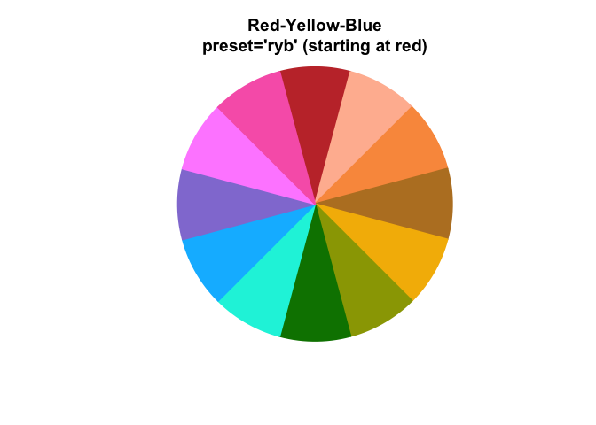
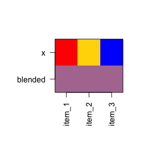
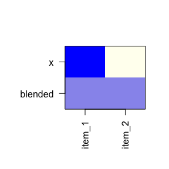
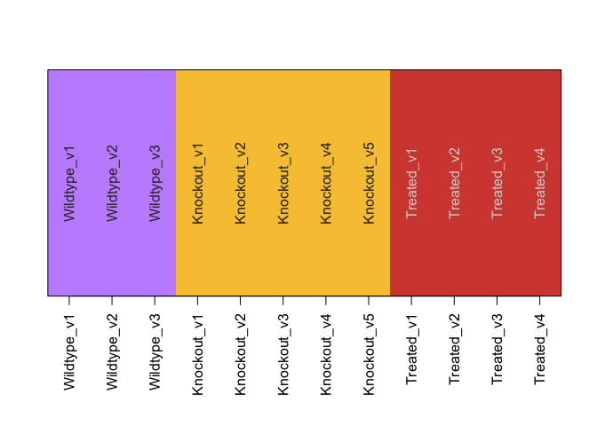

# colorjam 

The goal of colorjam is to provide useful color manipulation functions
for R data visualization.

It includes methods to generate dynamic categorical colors of arbitrary
length, providing as much visual separation between adjacent colors as
currently feasible.

## Installation

To install colorjam, use the `devtools` package installer:

> devtools::install\_github(“jmw86069/colorjam”);

Note that colorjam Depends upon the “jamba” package for some
manipulations.

## Command reference

A full command reference is provided using the `pkgdown::build_site()`
function, and is available here:

[Full command reference](https://jmw86069.github.io/colorjam)

## Quick start with colorjam

For the examples below, two packages are loaded:

``` r
library(colorjam);
library(jamba);
```

### Categorical colors

First generate some basic categorical colors, `n=5` colors. We will use
the function `jamba::showColors()` to display the colors.

``` r
showColors(rainbowJam(5));
```

<!-- -->

To illustrate the effect of increasing categorical colors, we will
create a list of categorical colors with increasing `n`.

``` r
colorList <- lapply(nameVector(c(5, 10, 20)), function(n){
   rainbowJam(n);
});
showColors(colorList,
   main="Dichromat color wheel (default colorjam)");
```

<!-- -->

By default, colorjam uses a “warped” color wheel, which produces a
dichromat (color blind friendly) color wheel.

There are several custom color wheel “presets”, for example
red-yellow-blue color wheel can be used with `preset="ryb"`.

``` r
colorList1 <- lapply(nameVector(c(5, 8, 16)), function(n){
   rainbowJam(n, preset="ryb", hue_pad_percent=100, do_hue_pad=TRUE);
});
showColors(colorList1,
   main="Red-Yellow-Blue color wheel (previous default rainbowJam)");
```

<!-- -->

To view Red-Green-Blue colors using the default color wheel in base R,
supply `warpHue=FALSE` as shown below, or use `preset="rgb"` to define
the red-green-blue color wheel.

``` r
colorList2 <- lapply(nameVector(c(5, 10, 20)), function(n){
   rainbowJam(n, warpHue=FALSE);
});
showColors(colorList2,
   main="Red-Green-Blue color wheel (base R)");
```

<!-- -->

### Color-blending (new in version 0.0.16.900)

The color wheel red-yellow-blue is particularly effective for
color-mixing operations. The function `blend_colors()` has some useful
features:

  - Paint color mixing style (blue + yellow = green)
  - Able to mix more than two colors
  - Accounts for color transparency during mixing

The argument `do_plot=TRUE` will plot a visual summary of the mixing
results.

``` r
blent1 <- blend_colors(c("red", "blue"), do_plot=TRUE);
```

<!-- -->

``` r
blent2 <- blend_colors(c("gold", "blue"), do_plot=TRUE);
```

<!-- -->

``` r
blent3 <- blend_colors(c("gold", "red"), do_plot=TRUE);
```

<!-- -->

``` r

blent4 <- blend_colors(c("gold", "deeppink4"), do_plot=TRUE);
```

<!-- -->

``` r
blent5 <- blend_colors(c("red", "green4"), do_plot=TRUE);
```

<!-- -->

``` r
blent6 <- blend_colors(c("blue", "darkorange"), do_plot=TRUE);
```

<!-- -->

``` r

blent7 <- blend_colors(c("red", "gold", "blue"), do_plot=TRUE);
```

<!-- -->

``` r

blent8 <- blend_colors(c("red1", "red3", "blue"), do_plot=TRUE);
```

<!-- -->

``` r
blent9 <- blend_colors(c("red1", "blue1", "blue4"), do_plot=TRUE);
```

<!-- -->

``` r

blent10 <- blend_colors(c("blue", "ivory"), do_plot=TRUE);
```

<!-- -->

``` r
blent10 <- blend_colors(c("red", "blue", "ivory"), do_plot=TRUE);
```

<!-- -->

### Color-splitting

Another technique to expand a color palette is to split colors into a
gradient, using the function `color2gradient()`.

This technique is useful when assigning categorical colors to a primary
group, then splitting those colors by a sub-grouping.

``` r
colorSet <- rainbowJam(5);
colorSet4 <- color2gradient(colorSet, n=4);
showColors(list(colorSet=rep(colorSet, each=4),
   colorSet4=unname(colorSet4)),
   main="Color split into 4 additional subsets.");
```

<!-- -->

The color gradient can be tuned to increase or reduce the contrast
between the light and dark colors:

``` r
colorSet <- rainbowJam(5);
colorSet4a <- color2gradient(colorSet,
   n=4,
   gradientWtFactor=1/4);
colorSet4c <- color2gradient(colorSet,
   n=4,
   gradientWtFactor=1);
colorSet4b <- color2gradient(colorSet,
   n=4,
   gradientWtFactor=2);
showColors(list(colorSet=rep(colorSet, each=4),
   `gradientWtFactor=1/4`=unname(colorSet4a),
   `gradientWtFactor=2/3\n(default)`=unname(colorSet4),
   `gradientWtFactor=1`=unname(colorSet4c),
   `gradientWtFactor=2`=unname(colorSet4b)),
   main="Colors adjusted with gradientWtFactor");
```

<!-- -->

### Assigning colors to groups

The function `group2colors()` takes a vector of group labels, and
assigns categorical colors using `rainbowJam()`. To illustrate the
process, each group will have a different number of replicates.

I use the helper function “makeNames()” which creates unique names for
each vector item. Typically the names represent sample identifiers of
some kind. The names are retained in the output color vector, which can
be helpful to ensure data is in the correct order during a sequence of
analysis steps.

``` r
groupLabels <- rep(c("Wildtype", "Knockout", "Treated"),
   c(3, 5, 4));
names(groupLabels) <- makeNames(groupLabels);
groupColors <- group2colors(groupLabels);
print(data.frame(groupLabels, groupColors));
#>             groupLabels groupColors
#> Wildtype_v1    Wildtype     #0091FF
#> Wildtype_v2    Wildtype     #0091FF
#> Wildtype_v3    Wildtype     #0091FF
#> Knockout_v1    Knockout     #D92029
#> Knockout_v2    Knockout     #D92029
#> Knockout_v3    Knockout     #D92029
#> Knockout_v4    Knockout     #D92029
#> Knockout_v5    Knockout     #D92029
#> Treated_v1      Treated     #FFB600
#> Treated_v2      Treated     #FFB600
#> Treated_v3      Treated     #FFB600
#> Treated_v4      Treated     #FFB600
showColors(groupColors);
```

<!-- -->

Colors are assigned in order, after sorting with `jamba::mixedSort()`,
which provides alphanumeric sorting. However, if the input vector is a
factor, the order of factor levels is maintained.

Sometimes it is helpful to split the colors by replicate using a color
gradient, using `jamba::color2gradient()`. This technique is helpful
when trying to make replicates visually distinct in a data
visualization.

``` r
groupColorsSplit <- group2colors(groupLabels,
   useGradient=TRUE);
showColors(groupColorsSplit);
```

<!-- -->

### ggplot2 color functions

There are a couple color functions useful with ggplot2.

  - scale\_color\_jam() defines categorical colors to the ggplot2
    `colour` property.
  - scale\_fill\_jam() defines categorical colors to the ggplot2 `fill`
    property.

These functions can be used directly in ggplot2 calls:

``` r
if (suppressPackageStartupMessages(require(ggplot2))) {
   dsamp <- diamonds[sample(nrow(diamonds), 1000),];
   d <- ggplot(dsamp, aes(carat, price)) +
      geom_point(aes(colour=cut, fill=cut), size=4, shape=21);
   
   d +
      scale_color_jam() +
      scale_fill_jam() +
      ggtitle("scale_color_jam()");
}
```

<!-- -->

Some plots use `"fill"` and `"colour"` properties, where the `"colour"`
defines an outline. In this case, the colors can be adjusted to be
lighter or darker using the `darkFactor` argument. The effect is to make
the outline color slightly darker, and the fill color slightly brighter.

``` r
if (suppressPackageStartupMessages(require(ggplot2))) {
   d +
      scale_color_jam(darkFactor=1.5) +
      scale_fill_jam(darkFactor=-1.2) +
      ggtitle("Adjustment using 'darkFactor'");
}
```

<!-- -->

### Alternate ggplot2 theme

An alternative ggplot2 theme is provided, which by default does not use
the newspaper-grey background color.

``` r
if (suppressPackageStartupMessages(require(ggplot2))) {
   d +
      scale_color_jam(darkFactor=1.5) +
      scale_fill_jam(darkFactor=-1.2) +
      ggtitle("theme_jam()") +
      theme_jam()
}
```

<!-- -->

Notably, this function provides some common arguments which can be
customized.

  - `base_size` = The default font size in points.
  - `blankGrid` = boolean which removes all background grid lines,
    alternatively use `blankXgrid` or `blankYgrid` for control of either
    the x-axis or y-axis, respectively.

For example, when creating figures for presentation slides or other
documents, it can be helpful to make the font substantially larger than
would be comfortable on a computer screen.

``` r
if (suppressPackageStartupMessages(require(ggplot2))) {
   d +
      scale_color_jam(darkFactor=1.5) +
      scale_fill_jam(darkFactor=-1.2) +
      ggtitle("theme_jam()") +
      theme_jam(base_size=24)
}
```

<!-- -->

### Naming colors

A small but useful function `closestRcolor()` takes a vector of colors,
and returns a vector of the closest R color name based upon the colors
defined by `colors()`.

The name is sometimes easier to remember and re-use than the hex format.

The function has an optional argument `showPalette=TRUE` which will plot
the original colors as well as the closest R color for comparison.

``` r
closestRcolor(rainbowJam(12),
   showPalette=TRUE);
```

<!-- -->

    #>          #D92029          #FF9C74          #FF6300          #A34F00 
    #>     "firebrick3"    "lightsalmon"         "tomato"         "sienna" 
    #>          #00D9FF          #0084E9          #0061FF          #B8C1FF 
    #>     "turquoise2"    "dodgerblue2"     "royalblue2"   "lightskyblue" 
    #>          #956FFF          #7D24FA          #FF65FF          #D43FCD 
    #> "lightslateblue"        "purple2"        "orchid1"       "magenta3"

Of course, not all hex colors have a close match in the named R colors,
but the closest color is returned nonetheless.
