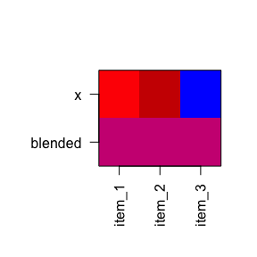

# colorjam 

## Why colorjam?

`colorjam` provides visually distinct categorical colors of arbitrary
length, using an optimized pattern of chroma/luminance values.

- **Scalable**. Generate visually distinct categorical colors of
  arbitrary length.
- **Color-blindness friendly**. Caveat: No set of colors can be
  represented perfectly for all types of color blindness. However the
  default color wheel in `colorjam` was optimized for maximal visual
  distinction between colors, informed by the three major types of color
  blindness simulated by the fantastic R package `dichromat()`.
- **Optimized for experiment design**. The first color default is gold,
  for experiment design factors that encode the control/reference as the
  first factor level. This reference is assigned the neutral color
  “gold” rather than bright red.
- **Flexible**. The color wheel can be changed to red-yellow-blue
  (painting), red-green-blue (default for computer monitors), or
  customized completely. The chroma/luminance step functions can be
  re-ordered or customized as well.

## Installation

To install colorjam, you may use the `remotes` package:

``` r
remotes::install_github("jmw86069/colorjam");
```

OR, we recommend the package `pacman` which helps keep the package
updated:

``` r
### if necessary, install pacman:
# install.packages("pacman")
library(pacman)
p_load_current_gh("jmw86069/colorjam")
```

The `colorjam` package is being prepared for CRAN in the “near” future.

## Command reference

The full command reference is available here:

[`colorjam` command reference](https://jmw86069.github.io/colorjam)

## Quick start with colorjam

For the examples below, two packages are loaded:

``` r
library(colorjam);
library(jamba);
```

### Categorical colors

#### dichromat

First generate some basic categorical colors, `n=5` colors. We will use
the function `jamba::showColors()` to display the colors.

``` r
showColors(rainbowJam(5));
```

<!-- -->

To illustrate the effect of increasing categorical colors, we will
create a list of categorical colors with increasing `n`.

``` r
colorList <- lapply(nameVector(c(12, 6, 3)), function(n){
   rainbowJam(n, nameStyle="n");
});
color_pie(colorList,
   main="Dichromat color wheel (default colorjam)");
```

<!-- -->

By default, colorjam uses a “dichromat” color wheel, which produces
color blindness friendly colors by avoiding a subset of colors that are
not visually distinct for the three major types of color blindness.

#### red-yellow-blue

The recommended “full rainbow” color wheel is “red-yellow-blue”,
distinctly different from the “red-green-blue” color wheel used in
computer monitor color generation, and which underpins the majority of
color functions in R.

The red-yellow-blue color wheel can be selected with:

- `preset="ryb"` for red-yellow-blue
- `preset="ryb2"` for red-yellow-blue that starts with yellow (shiown
  below).

``` r
colorList1 <- lapply(nameVector(c(16, 8, 5)), function(n){
   rainbowJam(n, preset="ryb2");
});
color_pie(colorList1,
   main="Red-Yellow-Blue color wheel (starting at yellow)");
```

<!-- -->

The benefit to starting color assignment with yellow is notable when the
first category in a set is considered the reference or control group.
For example, in a treatment study, the treatments are often encoded in
an order `c("Control", "Dexamethasone", "Etoposide")` so that
`"Control"` appears first. This order helps define statistical
comparisons where terms are compared to `"Control"`. As such, assigning
a neutral color to the control term is quite convenient.

Previous versions of colorjam used a red-yellow-blue color wheel
starting with red.

``` r
colorList1 <- lapply(nameVector(c(16, 8, 5)), function(n){
   rainbowJam(n, preset="ryb", step="v23", nameStyle="n");
});
color_pie(colorList1,
   main="Red-Yellow-Blue color wheel (previous default rainbowJam)");
```

<!-- -->

#### red-green-blue

Similarly, the default color wheel “red-green-blue” can be used:

- `preset="rgb"` the default RGB color wheel
- `preset="rgb2"` the default RGB color wheel, starting with yellow

The main reason not to use RGB is that so much of the color wheel is
green-blue, and green-blue are the most difficult to distinguish from
other colors with color blindness sensitive viewers.

``` r
colorList2 <- lapply(nameVector(c(20, 10, 5)), function(n){
   rainbowJam(n, preset="rgb2");
});
color_pie(colorList2,
   main="Red-Green-Blue color wheel (starting at yellow)");
```

<!-- -->

``` r
colorList2 <- lapply(nameVector(c(20, 10, 5)), function(n){
   rainbowJam(n, preset="rgb", step="v23");
});
color_pie(colorList2,
   main="Red-Green-Blue color wheel (base R)");
```

<!-- -->

### Color-blending

The color wheel red-yellow-blue is particularly effective for
color-mixing. The function `blend_colors()` has some useful features:

- **Paint-style blending**. blue + yellow = green. (For default RGB:
  blue + yellow = grey)
- **Scalable for multiple colors**. Able to mix more than two colors.
- **Transparency-aware**. Accounts for color transparency during mixing.

The argument `do_plot=TRUE` will plot a visual summary of the mixing
results.

``` r
blent1 <- blend_colors(c("red", "blue"), do_plot=TRUE);
```

<!-- -->

``` r
blent2 <- blend_colors(c("gold", "blue"), do_plot=TRUE);
```

<!-- -->

``` r
blent3 <- blend_colors(c("gold", "red"), do_plot=TRUE);
```

<!-- -->

``` r

# blent4 <- blend_colors(c("gold", "deeppink4"), do_plot=TRUE);
# blent5 <- blend_colors(c("red", "green4"), do_plot=TRUE);
# blent6 <- blend_colors(c("blue", "darkorange"), do_plot=TRUE);
# 
# blent7 <- blend_colors(c("red", "gold", "blue"), do_plot=TRUE);

blent8 <- blend_colors(c("red1", "red3", "blue"), do_plot=TRUE);
```

<!-- -->

``` r
blent9 <- blend_colors(c("red1", "blue1", "blue4"), do_plot=TRUE);
```

<!-- -->

``` r

# blent10 <- blend_colors(c("blue", "ivory"), do_plot=TRUE);
blent10 <- blend_colors(c("red", "blue", "ivory"), do_plot=TRUE);
```

<!-- -->

### Color-splitting

Another technique to expand a color palette is to split colors into a
gradient, using the function `color2gradient()`.

This technique is useful when assigning categorical colors to a primary
group, then splitting those colors by a sub-grouping.

``` r
colorSet <- rainbowJam(5);
colorSet4 <- color2gradient(colorSet, n=4);
color_pie(list(
   colorSet4=unname(colorSet4),
   colorSet=rep(colorSet, each=4)),
   main="Color split into 4 additional subsets.");
```

<!-- -->

The intensity of the color gradient is adjusted with `dex`, the darkness
expansion factor.

``` r
colorSet <- rainbowJam(5);
colorSet4a <- color2gradient(colorSet,
   n=4,
   dex=1/2);
colorSet4c <- color2gradient(colorSet,
   n=4,
   dex=3);
colorSet4b <- color2gradient(colorSet,
   n=4,
   dex=10);
color_pie(list(
   `dex=10`=unname(colorSet4b),
   `dex=3`=unname(colorSet4c),
   `dex=1\n(default)`=unname(colorSet4),
   `dex=1/2`=unname(colorSet4a),
   colorSet=rep(colorSet, each=4)),
   main="Intensity of the gradient is adjusted with 'dex'\n(darkness expansion factor)");
```

<!-- -->

### ggplot2 colors

- `scale_color_jam()` defines categorical colors for ggplot2 `colour`
- `scale_fill_jam()` defines categorical colors for ggplot2 `fill`

``` r
if (suppressPackageStartupMessages(require(ggplot2))) {
   dsamp <- ggplot2::diamonds[sample(nrow(ggplot2::diamonds), 1000),];
   d <- ggplot2::ggplot(dsamp, ggplot2::aes(carat, price)) +
      ggplot2::geom_point(ggplot2::aes(colour=cut, fill=cut), size=4, shape=21);
   
   d +
      scale_color_jam() +
      scale_fill_jam() +
      ggplot2::ggtitle("scale_color_jam()");
}
```

<!-- -->

Colors can be adjusted for darkness, saturation, to make interesting
point shapes:

``` r
if (suppressPackageStartupMessages(require(ggplot2))) {
   d +
      scale_color_jam(darkFactor=1.5) +
      scale_fill_jam(darkFactor=-1.2) +
      ggplot2::ggtitle("Adjustment using 'darkFactor'");
}
```

<!-- -->

### Custom ggplot2 theme

An alternative ggplot2 theme is provided, which by default does not use
the newspaper-grey background color.

``` r
if (suppressPackageStartupMessages(require(ggplot2))) {
   d +
      scale_color_jam(darkFactor=1.5) +
      scale_fill_jam(darkFactor=-1.2) +
      ggplot2::ggtitle("theme_jam()") +
      theme_jam()
}
```

<!-- -->

This function provides some common arguments to customize:

- `base_size`: The default font size in points.
- `blankGrid`: `logical` which removes all background grid lines.

``` r
if (suppressPackageStartupMessages(require(ggplot2))) {
   d +
      scale_color_jam(darkFactor=1.5) +
      scale_fill_jam(darkFactor=-1.2) +
      ggplot2::ggtitle("theme_jam()") +
      theme_jam(base_size=24)
}
```

<!-- -->

### Naming colors

`closestRcolor()` is used to assign a color name, matching the closest
reference color in a vector. The method uses HCL color space with the
red-yellow-blue color wheel, and custom weighting for H, C, and L color
channels.

It even matches greyscale colors properly, ignoring the unused “hue”
channel when saturation is very low.

The argument `showPalette=TRUE` will plot the original colors and the
closest R colors for comparison.

``` r
closestRcolor(c(rainbowJam(12), "grey"),
   showPalette=TRUE);
```

<!-- -->

    #>          #F7C53E          #C35E00          #FF8A66          #DC726B 
    #>          "gold2"     "chocolate3"        "salmon1"  "palevioletred" 
    #>          #FF89BA          #E86CED          #E9C0FF          #9169F9 
    #> "palevioletred1"        "orchid2"          "plum1" "lightslateblue" 
    #>          #AFA5FF          #8891EE          #95C3FF          #43AAFF 
    #>     "steelblue1" "cornflowerblue"       "skyblue1"     "steelblue2" 
    #>             grey 
    #>           "gray"

### Pre-defined color gradients (08-Apr-2021)

Two pre-defined gradients were added, motivated by the need for
linear/sequential and divergent color gradients that are also color
blindness friendly.

The linear/sequential gradients in `jam_linear` use a white baseline
color, to distinguish them from divergent gradients. However the same
names are used in `jam_linear` and `jam_divergent`.

``` r
jamba::showColors(jam_linear)
```

<!-- -->

The divergent color gradients in `jam_divergent` use a black background,
to be distinguished from the linear gradients. However they use the same
names, so that they can be paired as appropriate.

``` r
jamba::showColors(jam_divergent)
```

<!-- -->

The driving use case was to display genome sequence coverage heatmaps
with slightly different colors for each type of signal. We wanted linear
and divergent color gradients to use in tandem, for example
`"jam_linear$firebrick"` and `"jam_divergent$firebrick_skyblue"`.

### Color gradients

#### Two-step linear gradients

Two new functions provide some interesting and useful features.

`twostep_gradient()` combines two linear gradients into one linear
gradient, increasing the visual distinction across the gradient. It is
easier to show than to explain.

Two linear gradients, based upon orange and red, are combined:

``` r
ts1 <- twostep_gradient("orange2", "firebrick", n=11, debug=TRUE)
#>       w1    w2
#> 1  1.000 0.000
#> 2  1.000 0.000
#> 3  0.838 0.162
#> 4  0.686 0.314
#> 5  0.544 0.456
#> 6  0.414 0.586
#> 7  0.296 0.704
#> 8  0.192 0.808
#> 9  0.105 0.895
#> 10 0.037 0.963
#> 11 0.000 1.000
title("orange2 + firebrick");
```

<!-- -->

Two linear gradients, based upon aquamarine and blue, are combined:

``` r
ts2 <- twostep_gradient("aquamarine", "dodgerblue", n=11, debug=TRUE)
#>       w1    w2
#> 1  1.000 0.000
#> 2  1.000 0.000
#> 3  0.838 0.162
#> 4  0.686 0.314
#> 5  0.544 0.456
#> 6  0.414 0.586
#> 7  0.296 0.704
#> 8  0.192 0.808
#> 9  0.105 0.895
#> 10 0.037 0.963
#> 11 0.000 1.000
title("aquamarine + dodgerblue");
```

<!-- -->

#### Custom divergent gradients

`make_jam_divergent()` combines two linear gradients, using the two
gradients created above:

``` r
ts1ts2 <- make_jam_divergent(list(ts2=ts2),
   list(ts1=ts1),
   n=21)
jamba::showColors(ts1ts2)
```

<!-- -->
