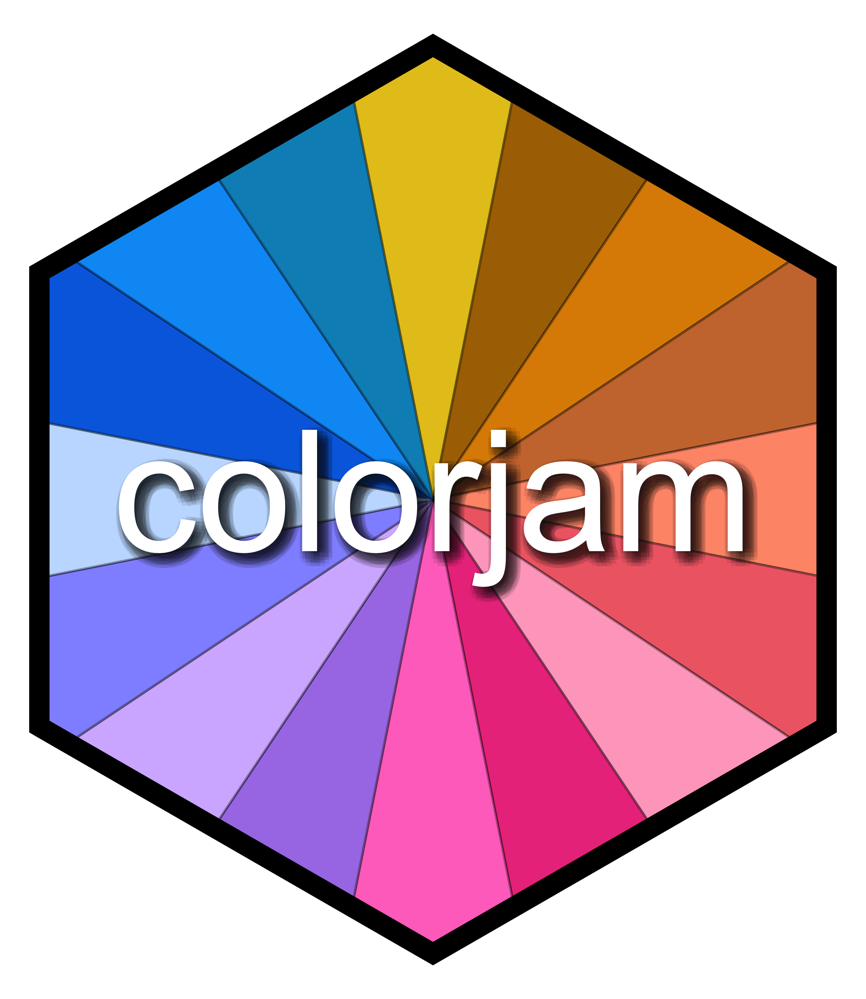
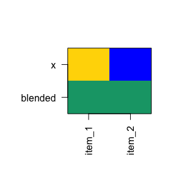

# colorjam 

## Why colorjam?

`colorjam` provides visually distinct categorical colors of arbitrary
length, using an optimized pattern of chroma/luminance values.

- **Scalable.** Visually distinct categorical colors of arbitrary
  length.

  - `rainbowJam(n)`
  - ggplot2 functions: `scale_color_jam()`, `scale_fill_jam()`

- **Color-blindness friendly.** Optimized for three kinds of color
  blindness.

<!--
   * The `"dichromat"` color wheel (default) is optimized for three kinds of
   color blindness, <br>
   as simulated by the `dichromat` package.
-->

- **Flexible.** `"dichromat"`, `"ryb"`, `"rgb"` color wheels are
  available.

<!--
   * `"dichromat"`: color-blindness optimized
   * `"ryb"`: red-yellow-blue "rainbow", additive color blending
   * `"rgb"`: red-green-blue "rainbow", default R, computer imaging
   * custom color wheels can be defined
-->

- **Optimized for statistical design.** First color
  <b style='color:#CDAD00'>gold</b> assigned to control groups:

<!--
   * **`"dichromat2"`**: color-blindness optimized, starts with gold (default)
   * `"ryb2"`: red-yellow-blue, additive color blending
   * `"rgb2"`: red-green-blue, default R, computer imaging
-->

- **Interactive R-shiny app.** `launchColorjamShiny()`

## Installation

Install colorjam using the `remotes` package:

``` r
remotes::install_github("jmw86069/colorjam");
```

OR, use `pacman` to keep the package updated:

``` r
### if necessary, install pacman:
# install.packages("pacman")
library(pacman)
p_load_current_gh("jmw86069/colorjam")
```

*The `colorjam` package is being prepared for CRAN in the “near”
future.*

## Command reference

The full command reference is available here:

[`colorjam` command reference](https://jmw86069.github.io/colorjam)

## Quick start with colorjam

For the examples below, two packages are loaded:

``` r
library(colorjam);
library(jamba);
```

### Categorical colors

#### dichromat (default)

Let’s generate `n=5` categorical colors, displayed by
`jamba::showColors()`.

``` r
showColors(rainbowJam(5));
```

<!-- -->

Alternatively, `color_pie()` displays colors in a pie circle.

``` r
color_pie(rainbowJam(5));
```

<!-- -->

Categorical colors are scalable.

``` r
color_pie(rainbowJam(15));
```

<!-- -->

Label the colors using the 4994 `named_colors`:

``` r
color_pie(rainbowJam(15, nameStyle="closest_named_color"));
```

<!-- -->

Gradually increase the number of colors, then use `color_pie()` to plot
them in concentric circles.

``` r
colorList <- lapply(nameVector(c(36, 24, 12)), function(n){
   rainbowJam(n, nameStyle="n");
});
color_pie(colorList,
   main="preset='dichromat2' (default)");
```

<!-- -->

##### What is “dichromat” here?

Every color system has a “color wheel” - something like
<B style='color:#CC0000'>red</B>-<B style='color:#009900'>green</B>-<B style='color:#0000EE'>blue</B>
(RGB) or
<B style='color:#CC0000'>red</B>-<B style='color:#DDCC00'>yellow</B>-<B style='color:#0000EE'>blue</B>
(RYB).

We defined a new color wheel `"dichromat"` to maximize the visual
distinction between color hues for people with color blindness. The
process was driven by R package `dichromat`, so we gave it that name out
of respect.

The `"dichromat"` color wheel allocates approximately equal halves of
the color wheel to be visually distinct for `"deutan"`, `"protan"`, and
`"tritan"` forms of color blindness. Roughly akin to using “cool”/“warm”
colors for each half the color wheel, for each simulated color. The
wheel avoids colors which are the most difficult to distinguish in the
color wheel.

It isn’t perfect.

However `colorjam` does provide the first scalable method (we have seen)
to produce categorical colors optimized for the three major forms of
color-blindness. Other excellent resources that provide color-blindness
friendly colors, which are not scalable. However to be fair, fixed
colors may be the best realistic approach, so `colorjam` may not be the
ideal solution.

#### red-yellow-blue

The “full rainbow” color wheel
“<B style='color:#CC0000'>red</B>-<B style='color:#DDCC00'>yellow</B>-<B style='color:#0000EE'>blue</B>”
is recommended over default RGB to provide the best full rainbow. It
performs particularly well for color blending (see
[Color-blending](#Color-blending)) for additive paint-like mixing.

- `preset="ryb"` for red-yellow-blue

``` r
colorList1 <- lapply(nameVector(c(12)), function(n){
   rainbowJam(n, preset="ryb");
});
color_pie(colorList1,
   main="Red-Yellow-Blue\npreset='ryb' (starting at red)");
```

<!-- -->

- `preset="ryb2"` (recommended) for yellow-red-blue, starting with
  yellow

``` r
colorList1 <- lapply(nameVector(c(16)), function(n){
   rainbowJam(n, preset="ryb2");
});
color_pie(colorList1,
   main="Yellow-Red-Blue\npreset='ryb2' (starting at yellow)");
```

<!-- -->

The reason to start with yellow is noticed when the first category in a
set is the reference or control group in a scientific experiment. It is
intuitive for the reference/control to have a neutral color, instead of
being bright red.

Previous versions (\<= 0.0.23.900) of colorjam used a red-yellow-blue
color wheel starting with red.

#### red-green-blue

Similarly, the R default
“<B style='color:#CC0000'>red</B>-<B style='color:#009900'>green</B>-<B style='color:#0000EE'>blue</B>”
color wheel:

- `preset="rgb"` the R default RGB color wheel

``` r
color_pie(
   rainbowJam(16, preset="rgb"),
   main="Red-Green-Blue\npreset='rgb' (starting at red)");
```

<!-- -->

*(Look how much of this color wheel is blue-green. This style is not for
me, haha.)*

- `preset="rgb2"` the R default RGB color wheel, starting with yellow

``` r
color_pie(
   rainbowJam(16, preset="rgb2"),
   main="Red-Green-Blue\npreset='rgb2' (starting at yellow)");
```

<!-- -->

#### More about color wheels

The 4994 colors provided in `named_colors` (see next section) are
collated from numerous sources, and ultimately represent colors that
people were motivated to name. Look how many named colors include
red/orange/yellow as compared to green/blue/purple! Then compare to the
RGB color wheel above, which disproportionately represents blue/green,
to the detriment of red/yellow.

Here, `named_colors` are filtered for at least Chroma 40 using
`subset_colors(named_colors, C > 40)`

``` r
color_pie(unname(
   subset_colors(named_colors, C > 40)))
```

<!-- -->

Clearly people can see many more red-orange-yellow, and comparatively
very few green/blue colors. This bias is partly from lower sensitivity
of colors such as “cyan”, and partly due to RGB color monitors being
unable to produce high saturation colors with that hue. Color theory is
fascinating, and endlessly complex, in part because each person is
slightly different.

### Color matching / Color naming

Two functions are provided to match colors to a reference set, which is
a convenient way to assign color names.

- `closestRcolor()`

  - matches colors to the 657 colors in `grDevices::colors()`, custom
    reference colors can be supplied.

- `closest_named_color()`

  - matches colors to **4883** `named_colors`, which adds 4447 colors
    from [meodai/named-colors](https://github.com/meodai/named-colors)
    (amazing!) and 436 colors not already represented from
    `grDevices::colors()`.

The argument `showPalette=TRUE` will plot the original colors and the
closest matched color for comparison.

``` r
cnc <- closest_named_color(c(rainbowJam(12), "grey"),
   showPalette=TRUE,
   main="closest_named_color() using `named_colors`");
```

<!-- -->

``` r
crc <- closestRcolor(c(rainbowJam(12), "grey"),
   showPalette=TRUE,
   main="closestRcolor() using `colors()`");
```

<!-- -->

There are two underlying methods:

- `"HCL"` (default) matches color hue by angle, with custom weights to
  channels H, C, and L.
- `"LUV"` matches colors using non-polar coordinates and Euclidean
  distance across the channels L, U, and V.

Greyscale colors are matches separately to a subset of grayscale
reference colors, to avoid using hue in unsaturated colors.

### Color-blending

`blend_colors()` has some useful features:

- **Paint-style blending**. blue + yellow = green. (For default RGB:
  blue + yellow = grey)
- **Scalable number of colors**. Able to mix more than two colors.
- **Transparency-aware**. Accounts for color transparency during mixing.

The argument `do_plot=TRUE` will plot a visual summary of the mixing
results.

``` r
blent1 <- blend_colors(c("red", "blue"), do_plot=TRUE);
```

<!-- -->

``` r
blent2 <- blend_colors(c("gold", "blue"), do_plot=TRUE);
```

<!-- -->

``` r
blent3 <- blend_colors(c("gold", "red"), do_plot=TRUE);
```

<!-- -->

``` r

blent8 <- blend_colors(c("red1", "red3", "blue"), do_plot=TRUE);
```

<!-- -->

``` r
blent9 <- blend_colors(c("red1", "blue1", "blue4"), do_plot=TRUE);
```

<!-- -->

``` r

blent10 <- blend_colors(c("red", "blue", "ivory"), do_plot=TRUE);
```

<!-- -->

### Color-splitting

`color2gradient()` can split colors using a light-dark gradient.

``` r
colorSet <- rainbowJam(5);
colorSet4 <- color2gradient(colorSet, n=4);
color_pie(list(
   colorSet4=unname(colorSet4),
   colorSet=rep(colorSet, each=4)),
   main="Color split into 4 additional subsets.");
```

<!-- -->

The intensity of the gradient is adjusted with `dex`, “darkness
expansion factor”.

``` r
colorSet <- rainbowJam(5);
colorSet4a <- color2gradient(colorSet,
   n=4,
   dex=1/2);
colorSet4c <- color2gradient(colorSet,
   n=4,
   dex=3);
colorSet4b <- color2gradient(colorSet,
   n=4,
   dex=10);
colorSet <- rep(colorSet, each=4)
names(colorSet4c) <- names(colorSet4b) <- names(colorSet4a) <- names(colorSet4) <- "";
names(colorSet4b)[5:8] <- c("  10", "  |", "  |", "  v")
names(colorSet4c)[5:8] <- c("  3", "  |", "  |", "  v")
names(colorSet4)[5:8] <- c(" 1", " |", " |", " v")
names(colorSet4a)[5:8] <- c("1/2", " |", " |", " v")
color_pie(list(
   `dex=10`=(colorSet4b),
   `dex=3`=(colorSet4c),
   `dex=1\n(default)`=(colorSet4),
   `dex=1/2`=(colorSet4a),
   colorSet=colorSet),
   main=paste0("Intensity of the gradient is adjusted with 'dex'\n",
      "(darkness expansion factor)"));
```

<!-- -->

### ggplot2 functions

- `scale_color_jam()` categorical colors for ggplot2 `colour`
- `scale_fill_jam()` categorical colors for ggplot2 `fill`

``` r
if (suppressPackageStartupMessages(require(ggplot2))) {
   dsamp <- ggplot2::diamonds[sample(nrow(ggplot2::diamonds), 1000),];
   d <- ggplot2::ggplot(dsamp, ggplot2::aes(carat, price)) +
      ggplot2::geom_point(ggplot2::aes(colour=cut, fill=cut), size=4, shape=21);
   
   d +
      scale_color_jam() +
      scale_fill_jam() +
      ggplot2::ggtitle("scale_color_jam()");
}
```

<!-- -->

Colors can be adjusted for darkness, saturation, to make interesting
point shapes:

``` r
if (suppressPackageStartupMessages(require(ggplot2))) {
   d +
      scale_color_jam(darkFactor=1.5) +
      scale_fill_jam(darkFactor=-1.2) +
      ggplot2::ggtitle("Adjustment using 'darkFactor'");
}
```

<!-- -->

### Custom ggplot2 theme

An alternative ggplot2 theme is provided.

``` r
if (suppressPackageStartupMessages(require(ggplot2))) {
   d +
      scale_color_jam(darkFactor=1.5) +
      scale_fill_jam(darkFactor=-1.2) +
      ggplot2::ggtitle("theme_jam()") +
      theme_jam()
}
```

<!-- -->

This function provides some common arguments to customize:

- `base_size`: `numeric` default font size in points.
- `blankGrid`: `logical` to remove all background grid lines.

``` r
if (suppressPackageStartupMessages(require(ggplot2))) {
   d +
      scale_color_jam(darkFactor=1.5) +
      scale_fill_jam(darkFactor=-1.2) +
      ggplot2::ggtitle("theme_jam()") +
      theme_jam(base_size=24)
}
```

<!-- -->

### Jam color gradients

- `jam_linear`: linear (sequential) gradients with white baseline color

``` r
jamba::showColors(jam_linear)
```

<!-- -->

- `jam_divergent`: divergent color gradients with black baseline color

``` r
jamba::showColors(jam_divergent)
```

<!-- -->

The driving use case was to display genome sequence coverage heatmaps
with slightly different colors for each type of signal. We wanted linear
and divergent color gradients to use in tandem, for example
`"jam_linear$firebrick"` and `"jam_divergent$firebrick_skyblue"`.

### Color gradients

#### Two-step linear gradients

`twostep_gradient()` combines two linear gradients into one linear
gradient.

Two linear gradients are combined, using orange and red:

``` r
ts1 <- twostep_gradient("orange2", "firebrick", n=11, debug=TRUE)
#>       w1    w2
#> 1  1.000 0.000
#> 2  1.000 0.000
#> 3  0.838 0.162
#> 4  0.686 0.314
#> 5  0.544 0.456
#> 6  0.414 0.586
#> 7  0.296 0.704
#> 8  0.192 0.808
#> 9  0.105 0.895
#> 10 0.037 0.963
#> 11 0.000 1.000
title("orange2 + firebrick");
```

<!-- -->

Two linear gradients are combined, using aquamarine and blue:

``` r
ts2 <- twostep_gradient("aquamarine", "dodgerblue", n=11, debug=TRUE)
#>       w1    w2
#> 1  1.000 0.000
#> 2  1.000 0.000
#> 3  0.838 0.162
#> 4  0.686 0.314
#> 5  0.544 0.456
#> 6  0.414 0.586
#> 7  0.296 0.704
#> 8  0.192 0.808
#> 9  0.105 0.895
#> 10 0.037 0.963
#> 11 0.000 1.000
title("aquamarine + dodgerblue");
```

<!-- -->

#### Custom divergent gradients

`make_jam_divergent()` combines two linear gradients.

``` r
ts1ts2 <- make_jam_divergent(list(ts2=ts2),
   list(ts1=ts1),
   n=21)
jamba::showColors(ts1ts2)
```

<!-- -->
