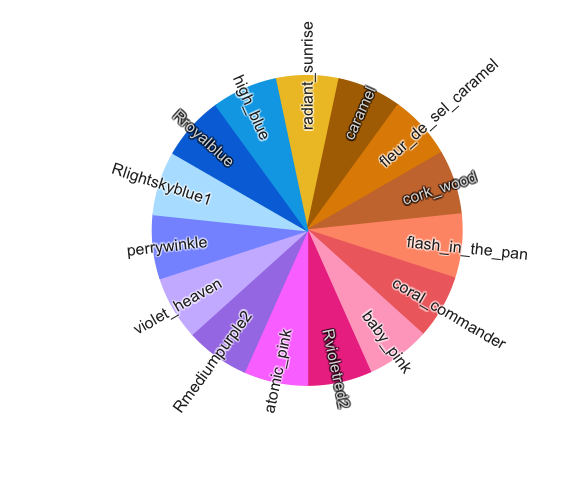
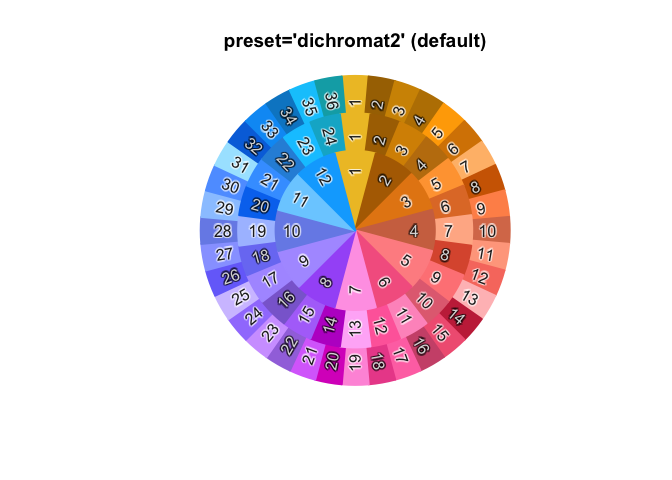
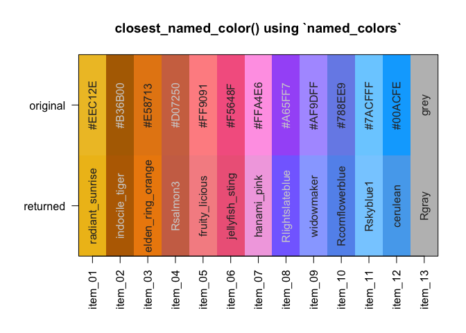
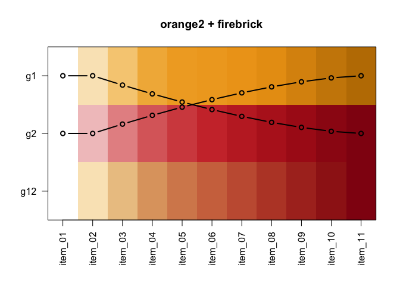

# colorjam 

## Why colorjam?

`colorjam` provides visually distinct categorical colors of arbitrary
length, using an optimized pattern of chroma/luminance values.

- **Scalable**. Generate visually distinct categorical colors of
  arbitrary length.
- **Color-blindness friendly**. Caveat: No set of colors can be
  represented perfectly for all types of color blindness. However the
  default color wheel in `colorjam` was optimized for maximal visual
  distinction between colors, informed by the three major types of color
  blindness simulated by the fantastic R package `dichromat()`.
- **Optimized for experiment design**. The first color default is gold,
  for experiment design factors that encode the control/reference as the
  first factor level. This reference is assigned the neutral color
  “gold” rather than bright red.
- **Flexible**. The color wheel can be changed to red-yellow-blue
  (painting), red-green-blue (default for computer monitors), or
  customized completely. The chroma/luminance step functions can be
  re-ordered or customized as well.

## Installation

To install colorjam, you may use the `remotes` package:

``` r
remotes::install_github("jmw86069/colorjam");
```

OR, we recommend the package `pacman` which helps keep the package
updated:

``` r
### if necessary, install pacman:
# install.packages("pacman")
library(pacman)
p_load_current_gh("jmw86069/colorjam")
```

The `colorjam` package is being prepared for CRAN in the “near” future.

## Command reference

The full command reference is available here:

[`colorjam` command reference](https://jmw86069.github.io/colorjam)

## Quick start with colorjam

For the examples below, two packages are loaded:

``` r
library(colorjam);
library(jamba);
```

### Scalable categorical colors

#### dichromat

First generate some basic categorical colors, `n=5` colors. We will use
the function `jamba::showColors()` to display the colors.

``` r
showColors(rainbowJam(5));
```

<!-- -->

Alternative the function `color_pie()` displays colors in a pie circle:

``` r
color_pie(rainbowJam(5));
```

<!-- -->

Categorical colors are scalable (to a point, but that point is around
100).

``` r
color_pie(rainbowJam(15));
```

<!-- -->

You can be fancy and name the output colors with `named_colors`:

``` r
color_pie(rainbowJam(15, nameStyle="closest_named_color"));
```

<!-- -->

`color_pie()` can plot a `list` of color vectors in concentric circles,
so below we plot an increasing number of categorical colors to
illustrate the scaling.

``` r
colorList <- lapply(nameVector(c(36, 24, 12)), function(n){
   rainbowJam(n, nameStyle="n");
});
color_pie(colorList,
   main="Dichromat color wheel (default colorjam)");
```

<!-- -->

##### What is “dichromat” here?

Every color system has a “color wheel” - something like red-green-blue
(RGB) or red-yellow-blue (RYB). Here, we defined a new color wheel
`"dichromat"` to maximize the distinction between color hues for people
with color blindness - and this approach used the R package `dichromat`.

The `"dichromat"` color wheel creates approximately equal halves of the
color wheel that accounts for simulated colors based upon `"deutan"`,
`"protan"`, and `"tritan"` forms of color blindness. That means
“cool/warm” colors should take approximately half the color wheel in
each case, while avoiding colors that are most difficult to distinguish
from others in the color wheel.

It isn’t perfect.

However `colorjam` does provide the first scalable method to produce
categorical colors, where colors are optimized for three forms of
color-blindness. There are other excellent resources that provide
color-blindness friendly colors, which are not scalable. To be fair,
this approach may not ultimately be much more scalable than methods that
provide a fixed maximum number of colors.

#### red-yellow-blue

The recommended “full rainbow” color wheel is “red-yellow-blue”, which
performs much better for most color operations such as blending colors
(additive mixing).

- `preset="ryb"` for red-yellow-blue
- `preset="ryb2"` for red-yellow-blue that starts with yellow (shiown
  below).

``` r
colorList1 <- lapply(nameVector(c(12)), function(n){
   rainbowJam(n, preset="ryb");
});
color_pie(colorList1,
   main="Red-Yellow-Blue color wheel\npreset='ryb' (starting at red)");
```

<!-- -->

``` r
colorList1 <- lapply(nameVector(c(16)), function(n){
   rainbowJam(n, preset="ryb2");
});
color_pie(colorList1,
   main="Red-Yellow-Blue color wheel\npreset='ryb2' (starting at yellow)");
```

<!-- -->

The reason to start with yellow is noticed when the first category in a
set is the reference or control group in a scientific experiment. It is
intuitive for the reference/control to have a neutral color, instead of
being bright red.

Previous versions (\<= 0.0.23.900) of colorjam used a red-yellow-blue
color wheel starting with red.

#### red-green-blue

Similarly, the R default “red-green-blue” color wheel:

- `preset="rgb"` the R default RGB color wheel
- `preset="rgb2"` the R default RGB color wheel, starting with yellow

``` r
color_pie(
   rainbowJam(16, preset="rgb"),
   main="Red-Green-Blue\npreset='rgb' (starting at red)");
```

<!-- -->

*(Look how much of this color wheel is blue-green. It is not for me.)*

``` r
color_pie(
   rainbowJam(16, preset="rgb2"),
   main="Red-Green-Blue\npreset='rgb2' (starting at yellow)");
```

<!-- -->

Too much of the RGB color wheel is green-blue.

Interesting aside: The 4994 total `named_colors` from the amazing Meodai
resource show a clear bias in color hues. Subsetting colors for at least
Chroma 40 with `subset_colors(named_colors, C > 40)`:

``` r
color_pie(unname(
   subset_colors(named_colors, C > 40)))
```

<!-- -->

Clearly people can see many more red-orange-yellow, and comparatively
very few green/blue colors. This bias is partly from lower sensitivity
of colors such as “cyan”, and partly due to RGB color monitors being
unable to produce high saturation colors with that hue. Color theory is
fascinating, and endlessly complex, in part because each person is
slightly different.

### Color matching / Naming colors

Two functions are provided to match colors to a reference set, which is
a convenient way to assign color names.

- `closestRcolor()` - matches colors to the 657 colors in
  `grDevices::colors()`, representing 502 unique hexadecimal colors.
  (Custom reference colors can be supplied.)
- `closest_named_color()` - matches to the much more comprehensive
  `named_colors`, which adds 4447 hexadecimal colors from
  [meodai/named-colors](https://github.com/meodai/named-colors), and 436
  colors unique to `grDevices::colors()`, representing **4883 named
  hexadecimal colors**.

The argument `showPalette=TRUE` will plot the original colors and the
closest R colors for comparison.

``` r
cnc <- closest_named_color(c(rainbowJam(12), "grey"),
   showPalette=TRUE,
   main="closest_named_color() using `named_colors`");
```

<!-- -->

``` r
crc <- closestRcolor(c(rainbowJam(12), "grey"),
   showPalette=TRUE,
   main="closestRcolor() using `colors()`");
```

<!-- -->

There are two underlying methods:

- `"HCL"` (default) uses color hue matching by angle, and applies custom
  weights to H, C, L channels.
- `"LUV"` converts to non-polar coordinates, and uses Euclidean distance
  across L, U, V channels.

The function separately matches greyscale colors to the subset of
grayscale reference colors, in order to ignore the “hue” which is still
stored.

### Color-blending

The function `blend_colors()` has some useful features:

- **Paint-style blending**. blue + yellow = green. (For default RGB:
  blue + yellow = grey)
- **Scalable number of colors**. Able to mix more than two colors.
- **Transparency-aware**. Accounts for color transparency during mixing.

The argument `do_plot=TRUE` will plot a visual summary of the mixing
results.

``` r
blent1 <- blend_colors(c("red", "blue"), do_plot=TRUE);
```

<!-- -->

``` r
blent2 <- blend_colors(c("gold", "blue"), do_plot=TRUE);
```

<!-- -->

``` r
blent3 <- blend_colors(c("gold", "red"), do_plot=TRUE);
```

<!-- -->

``` r

# blent4 <- blend_colors(c("gold", "deeppink4"), do_plot=TRUE);
# blent5 <- blend_colors(c("red", "green4"), do_plot=TRUE);
# blent6 <- blend_colors(c("blue", "darkorange"), do_plot=TRUE);
# 
# blent7 <- blend_colors(c("red", "gold", "blue"), do_plot=TRUE);

blent8 <- blend_colors(c("red1", "red3", "blue"), do_plot=TRUE);
```

<!-- -->

``` r
blent9 <- blend_colors(c("red1", "blue1", "blue4"), do_plot=TRUE);
```

<!-- -->

``` r

# blent10 <- blend_colors(c("blue", "ivory"), do_plot=TRUE);
blent10 <- blend_colors(c("red", "blue", "ivory"), do_plot=TRUE);
```

<!-- -->

### Color-splitting

Colors can be split into a light-dark gradient using `color2gradient()`.

This technique is useful when assigning categorical colors to a primary
group, then splitting those colors by a sub-grouping.

``` r
colorSet <- rainbowJam(5);
colorSet4 <- color2gradient(colorSet, n=4);
color_pie(list(
   colorSet4=unname(colorSet4),
   colorSet=rep(colorSet, each=4)),
   main="Color split into 4 additional subsets.");
```

<!-- -->

The intensity of the color gradient is adjusted with `dex`, “darkness
expansion factor”.

``` r
colorSet <- rainbowJam(5);
colorSet4a <- color2gradient(colorSet,
   n=4,
   dex=1/2);
colorSet4c <- color2gradient(colorSet,
   n=4,
   dex=3);
colorSet4b <- color2gradient(colorSet,
   n=4,
   dex=10);
colorSet <- rep(colorSet, each=4)
names(colorSet4c) <- names(colorSet4b) <- names(colorSet4a) <- names(colorSet4) <- "";
names(colorSet4b)[5:8] <- c("  10", "  |", "  |", "  v")
names(colorSet4c)[5:8] <- c("  3", "  |", "  |", "  v")
names(colorSet4)[5:8] <- c(" 1", " |", " |", " v")
names(colorSet4a)[5:8] <- c("1/2", " |", " |", " v")
color_pie(list(
   `dex=10`=(colorSet4b),
   `dex=3`=(colorSet4c),
   `dex=1\n(default)`=(colorSet4),
   `dex=1/2`=(colorSet4a),
   colorSet=colorSet),
   main="Intensity of the gradient is adjusted with 'dex'\n(darkness expansion factor)");
```

<!-- -->

### ggplot2 colors

- `scale_color_jam()` defines categorical colors for ggplot2 `colour`
- `scale_fill_jam()` defines categorical colors for ggplot2 `fill`

``` r
if (suppressPackageStartupMessages(require(ggplot2))) {
   dsamp <- ggplot2::diamonds[sample(nrow(ggplot2::diamonds), 1000),];
   d <- ggplot2::ggplot(dsamp, ggplot2::aes(carat, price)) +
      ggplot2::geom_point(ggplot2::aes(colour=cut, fill=cut), size=4, shape=21);
   
   d +
      scale_color_jam() +
      scale_fill_jam() +
      ggplot2::ggtitle("scale_color_jam()");
}
```

<!-- -->

Colors can be adjusted for darkness, saturation, to make interesting
point shapes:

``` r
if (suppressPackageStartupMessages(require(ggplot2))) {
   d +
      scale_color_jam(darkFactor=1.5) +
      scale_fill_jam(darkFactor=-1.2) +
      ggplot2::ggtitle("Adjustment using 'darkFactor'");
}
```

<!-- -->

### Custom ggplot2 theme

An alternative ggplot2 theme is provided, which by default does not use
the newspaper-grey background color.

``` r
if (suppressPackageStartupMessages(require(ggplot2))) {
   d +
      scale_color_jam(darkFactor=1.5) +
      scale_fill_jam(darkFactor=-1.2) +
      ggplot2::ggtitle("theme_jam()") +
      theme_jam()
}
```

<!-- -->

This function provides some common arguments to customize:

- `base_size`: The default font size in points.
- `blankGrid`: `logical` which removes all background grid lines.

``` r
if (suppressPackageStartupMessages(require(ggplot2))) {
   d +
      scale_color_jam(darkFactor=1.5) +
      scale_fill_jam(darkFactor=-1.2) +
      ggplot2::ggtitle("theme_jam()") +
      theme_jam(base_size=24)
}
```

<!-- -->

### Pre-defined color gradients (08-Apr-2021)

Two pre-defined gradients were added, motivated by the need for
linear/sequential and divergent color gradients that are also color
blindness friendly.

The linear/sequential gradients in `jam_linear` use a white baseline
color, to distinguish them from divergent gradients. However the same
names are used in `jam_linear` and `jam_divergent`.

``` r
jamba::showColors(jam_linear)
```

<!-- -->

The divergent color gradients in `jam_divergent` use a black background,
to be distinguished from the linear gradients. However they use the same
names, so that they can be paired as appropriate.

``` r
jamba::showColors(jam_divergent)
```

<!-- -->

The driving use case was to display genome sequence coverage heatmaps
with slightly different colors for each type of signal. We wanted linear
and divergent color gradients to use in tandem, for example
`"jam_linear$firebrick"` and `"jam_divergent$firebrick_skyblue"`.

### Color gradients

#### Two-step linear gradients

Two new functions provide some interesting and useful features.

`twostep_gradient()` combines two linear gradients into one linear
gradient, increasing the visual distinction across the gradient. It is
easier to show than to explain.

Two linear gradients, based upon orange and red, are combined:

``` r
ts1 <- twostep_gradient("orange2", "firebrick", n=11, debug=TRUE)
#>       w1    w2
#> 1  1.000 0.000
#> 2  1.000 0.000
#> 3  0.838 0.162
#> 4  0.686 0.314
#> 5  0.544 0.456
#> 6  0.414 0.586
#> 7  0.296 0.704
#> 8  0.192 0.808
#> 9  0.105 0.895
#> 10 0.037 0.963
#> 11 0.000 1.000
title("orange2 + firebrick");
```

<!-- -->

Two linear gradients, based upon aquamarine and blue, are combined:

``` r
ts2 <- twostep_gradient("aquamarine", "dodgerblue", n=11, debug=TRUE)
#>       w1    w2
#> 1  1.000 0.000
#> 2  1.000 0.000
#> 3  0.838 0.162
#> 4  0.686 0.314
#> 5  0.544 0.456
#> 6  0.414 0.586
#> 7  0.296 0.704
#> 8  0.192 0.808
#> 9  0.105 0.895
#> 10 0.037 0.963
#> 11 0.000 1.000
title("aquamarine + dodgerblue");
```

<!-- -->

#### Custom divergent gradients

`make_jam_divergent()` combines two linear gradients, using the two
gradients created above:

``` r
ts1ts2 <- make_jam_divergent(list(ts2=ts2),
   list(ts1=ts1),
   n=21)
jamba::showColors(ts1ts2)
```

<!-- -->
