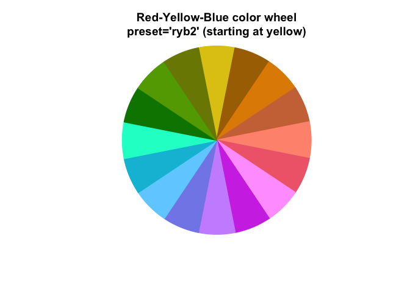

# colorjam 

## Why colorjam?

`colorjam` provides visually distinct categorical colors of arbitrary
length, optimized for distinctive colors. It is similar in concept to
`rainbow()` and `colorspace::rainbow_hcl()` except that those functions
do not attempt to make colors distinctive.

- **Visually distinct.**: Improved color contrast.

- **Scalable.** Categorical colors of arbitrary length.

  - `rainbowJam(n)`
  - ggplot2 functions: `theme_jam()`, or  
    `scale_color_jam()`, `scale_fill_jam()`

- **Color-blindness friendly.** Optimized color wheel across the three
  major types of color blindness.

- **Flexible.** Custom color wheels: `"dichromat"`, `"ryb"`, `"rgb"`

- **Optimized for statistical design.** Colors begin with
  <b style='color:#CDAD00'>gold</b> for control group.

- **Helpful Utilities**:

  - `theme_jam()` - ggplot2 theme which uses colorjam categorical
    colors.
  - `closestRcolor()` - assign R color name
  - `closest_named_color()` - assign *very diverse* color name
  - `group2colors()` - assign colors to unique group terms
  - `add_colors()` - add distinctive colors to existing categorical
    colors.
  - `color_complement()` - complement colors **with** custom color
    wheel.
  - `col_div_xf()` - divergent numeric-to-color function for heatmaps,
    bar charts, plots. Applies numeric max, and optional numeric floor.
  - `col_linear_xf()` - linear numeric-to-color function for heatmaps,
    bar charts, plots. Applies numeric max, and optional numeric floor.
  - `sort_colors()`, `subset_colors()` - sort or subset colors using
    numerous HCL, HSL, LUV color space properties.

## Installation

Install colorjam using the `remotes` package:

``` r
remotes::install_github("jmw86069/colorjam");
```

OR use `pak`:

``` r
### if necessary, install pacman:
# install.packages("pak")
pak::pkg_install("jmw86069/colorjam")
```

*`colorjam` is being prepared for CRAN.*

## Command reference

The full command reference is available here:

[`colorjam` command reference](https://jmw86069.github.io/colorjam)

## Quick start with colorjam

For the examples below, two packages are loaded:

``` r
library(colorjam);
library(jamba);
```

### Categorical colors

#### dichromat (default)

Let’s generate `n=5` categorical colors, displayed by
`jamba::showColors()`.

``` r
showColors(rainbowJam(5));
```


Alternatively, `color_pie()` displays colors in a pie circle.

``` r
color_pie(rainbowJam(5));
```


Categorical colors are scalable.

``` r
color_pie(rainbowJam(15));
```


Label the colors using the 4994 `named_colors`:

``` r
color_pie(rainbowJam(15, nameStyle="closest_named_color"));
```


Gradually increase the number of colors, then use `color_pie()` to plot
them in concentric circles.

``` r
colorList <- lapply(nameVector(c(36, 24, 12)), function(n){
   rainbowJam(n, nameStyle="n");
});
color_pie(colorList,
   main="preset='dichromat2' (default)");
```


##### What is “dichromat” here?

Every color system has a “color wheel” - something like
<B style='color:#CC0000'>red</B>-<B style='color:#009900'>green</B>-<B style='color:#0000EE'>blue</B>
(RGB) or
<B style='color:#CC0000'>red</B>-<B style='color:#DDCC00'>yellow</B>-<B style='color:#0000EE'>blue</B>
(RYB).

We defined a new color wheel `"dichromat"` to maximize the visual
distinction between color hues for people with color blindness. The
process was driven by R package `dichromat`, so we gave it that name out
of respect.

The `"dichromat"` color wheel allocates approximately equal halves of
the color wheel to be visually distinct for `"deutan"`, `"protan"`, and
`"tritan"` forms of color blindness. Roughly akin to using “cool”/“warm”
colors for each half the color wheel, for each simulated color. The
wheel avoids colors which are the most difficult to distinguish in the
color wheel.

It isn’t perfect.

However `colorjam` does provide the first scalable method (we have seen)
to produce categorical colors optimized for the three major forms of
color-blindness. Other excellent resources that provide color-blindness
friendly colors, which are not scalable. However to be fair, fixed
colors may be the best realistic approach, so `colorjam` may not be the
ideal solution.

#### red-yellow-blue

The “full rainbow” color wheel
“<B style='color:#CC0000'>red</B>-<B style='color:#DDCC00'>yellow</B>-<B style='color:#0000EE'>blue</B>”
is recommended over default RGB to provide the best full rainbow. It
performs particularly well for color blending (see
[Color-blending](#Color-blending)) for additive paint-like mixing.

- `preset="ryb"`: red-yellow-blue

``` r
color_pie(rainbowJam(12, preset="ryb"),
   main="Red-Yellow-Blue\npreset='ryb' (starting at red)");
```


- `preset="ryb2"`: yellow-red-blue

``` r
color_pie(rainbowJam(12, preset="ryb2"),
   main="Yellow-Red-Blue\npreset='ryb2' (starting at yellow)");
```



#### red-green-blue

Similarly, the R default
“<B style='color:#CC0000'>red</B>-<B style='color:#009900'>green</B>-<B style='color:#0000EE'>blue</B>”
color wheel:

- `preset="rgb"`: R default RGB color wheel

``` r
color_pie(
   rainbowJam(16, preset="rgb"),
   main="Red-Green-Blue\npreset='rgb' (starting at red)");
```


\*(Look how much of this color wheel is blue-green!)

- `preset="rgb2"`: R default RGB color wheel starting with yellow

``` r
color_pie(
   rainbowJam(16, preset="rgb2"),
   main="Red-Green-Blue\npreset='rgb2' (starting at yellow)");
```


#### More about color wheels

The 4994 colors provided in `named_colors` (see next section) are
collated from numerous sources. **These are 4,994 unique colors that
people were motivated to name.**

More than half the circle represents red/orange/yellow! Very little
includes green, in contrast to the RGB color wheel above.

Here, `named_colors` are filtered for at least Chroma 40 using
`subset_colors(named_colors, C > 40)`

``` r
color_pie(unname(
   subset_colors(named_colors, C > 40)))
```


Clearly people can see many more red-orange-yellow, and comparatively
very few green/blue colors. This bias is partly from lower sensitivity
of colors such as “cyan”, and partly due to RGB color monitors being
unable to produce high saturation colors with that hue. Color theory is
fascinating, and endlessly complex, in part because each person is
slightly different.

### Color matching / Color naming

Two functions are provided to match colors to a reference set, which is
a convenient way to assign color names.

- `closestRcolor()`

  - matches colors to the 657 colors in `grDevices::colors()`, custom
    reference colors can be supplied.

- `closest_named_color()`

  - matches colors to **4883** `named_colors`, which adds 4447 colors
    from [meodai/named-colors](https://github.com/meodai/named-colors)
    (amazing!) and 436 colors not already represented from
    `grDevices::colors()`.

The argument `showPalette=TRUE` will plot the original colors and the
closest matched color for comparison.

``` r
cnc <- closest_named_color(c(rainbowJam(12), "grey"),
   showPalette=TRUE,
   main="closest_named_color() using colorjam `named_colors`");
```


``` r
crc <- closestRcolor(c(rainbowJam(12), "grey"),
   showPalette=TRUE,
   main="closestRcolor() using R `colors()`");
```


Greyscale colors are matches separately to a subset of grayscale
reference colors, to avoid using hue in unsaturated colors.

### Color-blending

`blend_colors()` has some useful features:

- **Paint-style blending**. blue + yellow = green. (For default RGB:
  blue + yellow = grey)
- **Scalable number of colors**. Able to mix more than two colors.
- **Transparency-aware**. Accounts for color transparency during mixing.

The argument `do_plot=TRUE` will plot a visual summary of the mixing
results.

``` r
blent1 <- blend_colors(c("red", "blue"), do_plot=TRUE);
```


``` r
blent2 <- blend_colors(c("gold", "blue"), do_plot=TRUE);
```


``` r
blent3 <- blend_colors(c("gold", "red"), do_plot=TRUE);
```


``` r

blent8 <- blend_colors(c("red1", "red3", "blue"), do_plot=TRUE);
```


``` r
blent9 <- blend_colors(c("red1", "blue1", "blue4"), do_plot=TRUE);
```


``` r

blent10 <- blend_colors(c("red", "blue", "ivory"), do_plot=TRUE);
```


### Color-splitting

`color2gradient()` can split colors using a light-dark gradient.

``` r
colorSet <- rainbowJam(5);
colorSet4 <- color2gradient(colorSet, n=4);
color_pie(list(
   colorSet4=unname(colorSet4),
   colorSet=rep(colorSet, each=4)),
   main="Color split into 4 additional subsets.");
```


The intensity of the gradient is adjusted with `dex`, “darkness
expansion factor”.

``` r
colorSet <- rainbowJam(5);
colorSet4a <- color2gradient(colorSet,
   n=4,
   dex=1/2);
colorSet4c <- color2gradient(colorSet,
   n=4,
   dex=3);
colorSet4b <- color2gradient(colorSet,
   n=4,
   dex=10);
colorSet <- rep(colorSet, each=4)
names(colorSet4c) <- names(colorSet4b) <- names(colorSet4a) <- names(colorSet4) <- "";
names(colorSet4b)[5:8] <- c("  10", "  |", "  |", "  v")
names(colorSet4c)[5:8] <- c("  3", "  |", "  |", "  v")
names(colorSet4)[5:8] <- c(" 1", " |", " |", " v")
names(colorSet4a)[5:8] <- c("1/2", " |", " |", " v")
color_pie(list(
   `dex=10`=(colorSet4b),
   `dex=3`=(colorSet4c),
   `dex=1\n(default)`=(colorSet4),
   `dex=1/2`=(colorSet4a),
   colorSet=colorSet),
   main=paste0("Intensity of the gradient is adjusted with 'dex'\n",
      "(darkness expansion factor)"));
```


### ggplot2 functions

- `theme_jam()` uses colorjam categorical colors by default.
- `scale_color_jam()` categorical colors for ggplot2 `colour`
- `scale_fill_jam()` categorical colors for ggplot2 `fill`

``` r
if (suppressPackageStartupMessages(require(ggplot2))) {
   dsamp <- ggplot2::diamonds[sample(nrow(ggplot2::diamonds), 1000),];
   dsamp$cut <- as.character(dsamp$cut);
   d <- ggplot2::ggplot(dsamp, ggplot2::aes(carat, price)) +
      ggplot2::geom_point(ggplot2::aes(colour=cut, fill=cut),
         size=4,
         shape=21);
   
   d +
      theme_jam() +
      ggplot2::ggtitle("theme_jam()");
}
```


Features with color and fill can be enhanced using
`theme_jam(darken_colour=TRUE)` to add a subtle darker border:

``` r
if (suppressPackageStartupMessages(require(ggplot2))) {
   d +
      theme_jam(darken_colour=TRUE)
      ggplot2::ggtitle("Adjustment with 'darken_colour=TRUE'");
}
#> <ggplot2::labels> List of 1
#>  $ title: chr "Adjustment with 'darken_colour=TRUE'"
```

`theme_jam()` provides some convenient arguments to customize:

- `base_size`: `numeric` default font size in points.
- `blankGrid`: `logical` to remove all background grid lines.

Shown below are some customizations, including grey background, in order
to make the ggplot2 grey background more Jam-like.

``` r
if (suppressPackageStartupMessages(require(ggplot2))) {
   d +
      ggplot2::ggtitle("theme_jam()") +
      theme_jam(darken_colour=TRUE,
         panel.grid.major.colour="white",
         panel.grid.minor.colour="white",
         panel.background=ggplot2::element_rect(fill="#EEEEEE"),
         base_size=24)
}
```


### Tidy Colors

The `colors_to_df()` output is a `data.frame` with sufficient columns to
enable tidy filtering.

An example with `data.frame` output is shown below:

``` r
colors_df <- head(colors_to_df(named_colors), 20);
colors_df
```

<div class="kable-table">

|  | num | hex | name | H | C | L | alpha | red | green | blue | h | s | v | hsl_h | hsl_s | hsl_l | luv_l | luv_u | luv_v | yxy_y1 | yxy_x | yxy_y2 |
|:---|---:|:---|:---|---:|---:|---:|---:|---:|---:|---:|---:|---:|---:|---:|---:|---:|---:|---:|---:|---:|---:|---:|
| pink_prestige | 1 | \#EE99AAFF | pink_prestige | 0.0705808 | 54.40326 | 72.13857 | 1 | 238 | 153 | 170 | 0.9666667 | 0.3571429 | 0.9333333 | 348.0000 | 71.42857 | 76.66667 | 72.13857 | 54.40322 | 0.0670176 | 43.865593 | 0.3811828 | 0.3101709 |
| raspberry | 2 | \#B00149FF | raspberry | 0.2808081 | 102.90505 | 37.36411 | 1 | 176 | 1 | 73 | 0.9314286 | 0.9943182 | 0.6901961 | 335.3143 | 98.87006 | 34.70588 | 37.36411 | 102.90382 | 0.5043382 | 9.735851 | 0.5306635 | 0.2702127 |
| vivid_raspberry | 3 | \#FF006CFF | vivid_raspberry | 0.5142031 | 150.75152 | 54.39601 | 1 | 255 | 0 | 108 | 0.9294118 | 1.0000000 | 1.0000000 | 334.5882 | 100.00000 | 50.00000 | 54.39601 | 150.74545 | 1.3529069 | 22.349625 | 0.5328406 | 0.2709530 |
| borderline_pink | 4 | \#EE1166FF | borderline_pink | 0.5247145 | 138.14189 | 51.31679 | 1 | 238 | 17 | 102 | 0.9358974 | 0.9285714 | 0.9333333 | 336.9231 | 86.66667 | 50.00000 | 51.31679 | 138.13609 | 1.2650851 | 19.543224 | 0.5276855 | 0.2723711 |
| strawberry_milkshake | 5 | \#D47186FF | strawberry_milkshake | 0.6298097 | 65.86261 | 59.46350 | 1 | 212 | 113 | 134 | 0.9646465 | 0.4669811 | 0.8313725 | 347.2727 | 53.51351 | 63.72549 | 59.46350 | 65.85863 | 0.7239639 | 27.531948 | 0.4115168 | 0.3032503 |
| pink | 6 | \#FFC0CBFF | pink | 0.6598403 | 38.58612 | 83.58652 | 1 | 255 | 192 | 203 | 0.9708995 | 0.2470588 | 1.0000000 | 349.5238 | 100.00000 | 87.64706 | 83.58652 | 38.58356 | 0.4443627 | 63.274348 | 0.3559281 | 0.3177817 |
| fever_dream | 7 | \#DD5577FF | fever_dream | 0.6636920 | 93.23099 | 55.28332 | 1 | 221 | 85 | 119 | 0.9583333 | 0.6153846 | 0.8666667 | 345.0000 | 66.66667 | 60.00000 | 55.28332 | 93.22473 | 1.0799272 | 23.205436 | 0.4571880 | 0.2914646 |
| blush_hour | 8 | \#FF6F91FF | blush_hour | 0.6994852 | 98.31289 | 65.49801 | 1 | 255 | 111 | 145 | 0.9606481 | 0.5647059 | 1.0000000 | 345.8333 | 100.00000 | 71.76471 | 65.49801 | 98.30557 | 1.2002055 | 34.679035 | 0.4430580 | 0.2952573 |
| warm_pink | 9 | \#FB5581FF | warm_pink | 0.7309388 | 114.38859 | 60.42453 | 1 | 251 | 85 | 129 | 0.9558233 | 0.6613546 | 0.9843137 | 344.0964 | 95.40230 | 65.88235 | 60.42453 | 114.37928 | 1.4592488 | 28.597258 | 0.4727965 | 0.2876836 |
| minted_blueberry_lemonade | 10 | \#B32651FF | minted_blueberry_lemonade | 0.8475109 | 93.79360 | 40.51949 | 1 | 179 | 38 | 81 | 0.9491726 | 0.7877095 | 0.7019608 | 341.7021 | 64.97696 | 42.54902 | 40.51949 | 93.78333 | 1.3873308 | 11.567001 | 0.5034147 | 0.2803467 |
| plum_cheese | 11 | \#670728FF | plum_cheese | 1.0703754 | 54.14944 | 20.78795 | 1 | 103 | 7 | 40 | 0.9427083 | 0.9320388 | 0.4039216 | 339.3750 | 87.27273 | 21.56863 | 20.78795 | 54.13999 | 1.0115379 | 3.189649 | 0.5242263 | 0.2762370 |
| just_pink_enough | 12 | \#FFEBEEFF | just_pink_enough | 1.0844364 | 11.40565 | 94.67497 | 1 | 255 | 235 | 238 | 0.9750000 | 0.0784314 | 1.0000000 | 351.0000 | 100.00000 | 96.07843 | 94.67497 | 11.40361 | 0.2158617 | 86.850890 | 0.3243488 | 0.3261197 |
| love_juice | 13 | \#CC1155FF | love_juice | 1.1132992 | 118.16675 | 44.08672 | 1 | 204 | 17 | 85 | 0.9393939 | 0.9166667 | 0.8000000 | 338.1818 | 84.61538 | 43.33333 | 44.08672 | 118.14445 | 2.2959227 | 13.898292 | 0.5294945 | 0.2751588 |
| i_love_you_pink | 14 | \#D97D8FFF | i_love_you_pink | 1.1227836 | 60.58866 | 62.84847 | 1 | 217 | 125 | 143 | 0.9673913 | 0.4239631 | 0.8509804 | 348.2609 | 54.76190 | 67.05882 | 62.84847 | 60.57703 | 1.1872358 | 31.405506 | 0.4002688 | 0.3072867 |
| vampirella | 15 | \#9B2848FF | vampirella | 1.1384221 | 76.40123 | 35.89973 | 1 | 155 | 40 | 72 | 0.9536232 | 0.7419355 | 0.6078431 | 343.3043 | 58.97436 | 38.23529 | 35.89973 | 76.38615 | 1.5179325 | 8.956152 | 0.4911980 | 0.2847877 |
| köfte_brown | 16 | \#773644FF | köfte_brown | 1.1754052 | 41.65790 | 31.75826 | 1 | 119 | 54 | 68 | 0.9641026 | 0.5462185 | 0.4666667 | 347.0769 | 37.57225 | 33.92157 | 31.75826 | 41.64914 | 0.8545391 | 6.978651 | 0.4290555 | 0.3002969 |
| sprinkled_with_pink | 17 | \#E7A2AEFF | sprinkled_with_pink | 1.1934883 | 43.38015 | 73.47320 | 1 | 231 | 162 | 174 | 0.9710145 | 0.2987013 | 0.9058824 | 349.5652 | 58.97436 | 77.05882 | 73.47320 | 43.37074 | 0.9035563 | 45.888618 | 0.3678610 | 0.3154297 |
| mellow_melon | 18 | \#EE2266FF | mellow_melon | 1.3680192 | 134.59582 | 52.15941 | 1 | 238 | 34 | 102 | 0.9444444 | 0.8571429 | 0.9333333 | 340.0000 | 85.71429 | 53.33333 | 52.15941 | 134.55745 | 3.2133636 | 20.286331 | 0.5238221 | 0.2779303 |
| paper_hearts | 19 | \#CC4466FF | paper_hearts | 1.5145482 | 93.72115 | 49.41683 | 1 | 204 | 68 | 102 | 0.9583333 | 0.6666667 | 0.8000000 | 345.0000 | 57.14286 | 53.33333 | 49.41683 | 93.68841 | 2.4771227 | 17.934716 | 0.4753347 | 0.2902652 |
| coral_paradise | 20 | \#E76682FF | coral_paradise | 1.6624202 | 88.49063 | 59.98619 | 1 | 231 | 102 | 130 | 0.9638243 | 0.5584416 | 0.9058824 | 346.9767 | 72.88136 | 65.29412 | 59.98619 | 88.45338 | 2.5671695 | 28.108005 | 0.4431370 | 0.2984228 |

</div>

Two key function use this `data.frame` behavior:

1.  `sort_colors()`

    - Sorting colors requires choosing criteria to sort, and any column
      returned by `colors_to_df()` can be used.
    - Most often, it uses the color hue from HCL `'H'`. Did you know
      that the `'HCL'` and `'hsv'` hues are not the same? They aren’t
      even in the same order!
    - The argument `byCols` is used to define the columns to sort, for
      example: `byCols=c("H", "C", "L")`

2.  `subset_colors()`

    - Again, any column returned by `colors_to_df()` can be used with
      ‘…’ to apply the equivalent of `subset()` on the `data.frame`.
    - In fact, shhhhh `sort_colors()` and `subset_colors()` can both
      filter, and can both sort by columns. The main difference is that
      `subset_colors()` does not enable sorting by default, while
      `sort_colors()` does sort by default.

``` r
new_colors <- head(subset_colors(named_colors,
   H > 21 & H < 30 & C > 80,
   byCols=c("H", "-C", "-L")), 20)
color_pie(new_colors)
```


